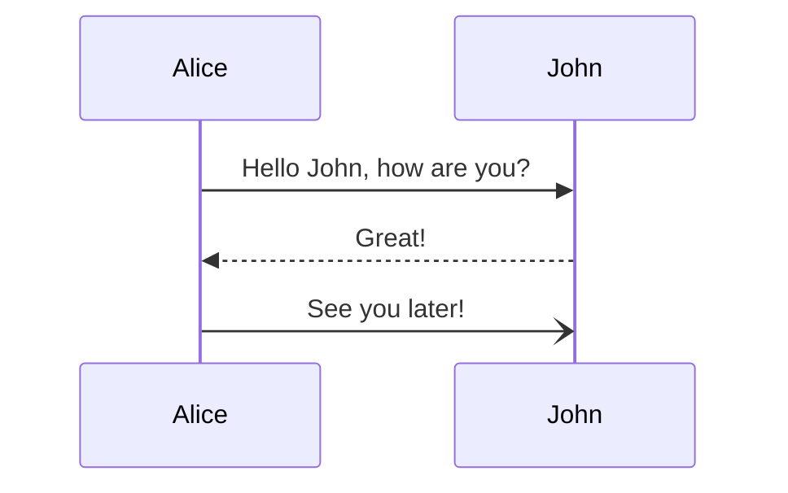

# はじめに
この記事では、パスワードレス認証技術であるFIDO2について紹介し、実際にブラウザ上でパスワードレス認証を行うプロジェクトの作成方法を解説します。

### 目次
:::details この記事の目次（クリックして開く）
1. [FIDO2ってなんだ?]()
2. [認証の流れ]()
3. [WebAuthn]()
4. [WebAuthnを使用して指紋認証してみる]()
5. [Server側の実装]()
6. [Webアプリ側の実装]()
7. [おわり]()
:::

### 環境
この記事では主にNode.js&Voltaを使用します。
VoltaはNode.jsのバージョン管理ツールです。Voltaの導入方法は以下の記事を参考にしてください。
https://nullnull.dev/blog/how-to-use-volta-in-mac/

## 1. FIDO2ってなんだ？
**FIDO2**はFIDOという団体が策定した、パスワードレス認証の技術のことです。
**FIDO2**を利用すると、外部認証器（USBキーやスマホなど）に加え、**スマホやPCに搭載された認証器（指紋や顔など）** を用いて、パスワードを入力することなく認証プロセスを行うことができます。

## 2. 登録・認証の流れ
認証の流れをざっくりと説明します。
認証には**チャレンジ&レスポンス方式**を用います。

::::details チャレンジ&レスポンス方式 とは？
#### 概要

チャレンジコードという文字列を用いた認証方法。パスワードを直接送信することなく認証を行うことができる点が特徴。

#### 認証の流れ
1. 認証を行う側が作った**チャレンジコード**を認証を受ける側に送る
2. 認証を受けるが側が設定した**パスワード**と**チャレンジコード**を組み合わせた**レスポンス**を返す
3. 認証を行う側でもDB等に保存されている**パスワード**と**チャレンジコード**を組み合わせ、2の**レスポンス**と比較する
4. 一致した場合は認証成功、一致しなかった場合は認証失敗を認証を受ける側に返す

----

参考：[チャレンジレスポンス認証 - わわわIT用語辞典](https://wa3.i-3-i.info/word12765.html)
::::

### 登録

### 認証

[参考](https://dev.classmethod.jp/articles/passwordless-authentication-and-fido2/#:~:text=%E3%82%B5%E3%83%9D%E3%83%BC%E3%83%88%E3%81%97%E3%81%BE%E3%81%99%E3%80%82-,FIDO2%E3%81%AE%E3%83%95%E3%83%AD%E3%83%BC,-FIDO2%E3%81%AE%E5%87%A6%E7%90%86)

## 3. WebAuthn
「じゃあFIDO2を使って実際にWebのログインページとかで指紋認証を使うにはどうすればいいんだい？」と思うでしょう。
そのためには、**WebAuthn**というAPIを使う必要があります。
WebAuthnとは、FIDO2の認証プロセスをWebブラウザ上で実行するためのAPIです。
このAPIを通すことで、指紋情報を認証情報に変換したり、認証器を使って認証を行うことができます。

APIはすでに多くのブラウザでサポートされており、ChromeはLinux以外のすべてOSでサポートされています。
[webAuthnのサポート状況 - webauthn.me](https://webauthn.me/browser-support)

## 4. WebAuthnを使用して指紋認証してみる

## 5. Server側の実装

## 6. Webアプリ側の実装

## 7. おわり

---
**参考資料・リンク**
- asd
- asd

<!--
- https://www.nri-secure.co.jp/blog/what-is-webauthn
- https://developers.google.com/codelabs/webauthn-reauth?hl=ja#0
- https://speakerdeck.com/k2wanko/fido2-actualized-by-firebase-for-the-password-less-future?slide=23
- https://dev.classmethod.jp/articles/passwordless-authentication-and-fido2/
- https://fidoalliance.org/%E4%BB%95%E6%A7%98%E6%A6%82%E8%A6%81/?lang=ja
- https://fidoalliance.org/fido%E3%81%AE%E4%BB%95%E7%B5%84%E3%81%BF/?lang=ja
- https://webauthn.io/
- https://zenn.dev/zenn/articles/markdown-guide#%E3%83%86%E3%82%AD%E3%82%B9%E3%83%88%E3%83%AA%E3%83%B3%E3%82%AF
- https://mermaid.js.org/syntax/sequenceDiagram.html
- https://www.trustbind.jp/column/fido-20211019.html
- https://it-trend.jp/encryption/article/64-0089
-->

